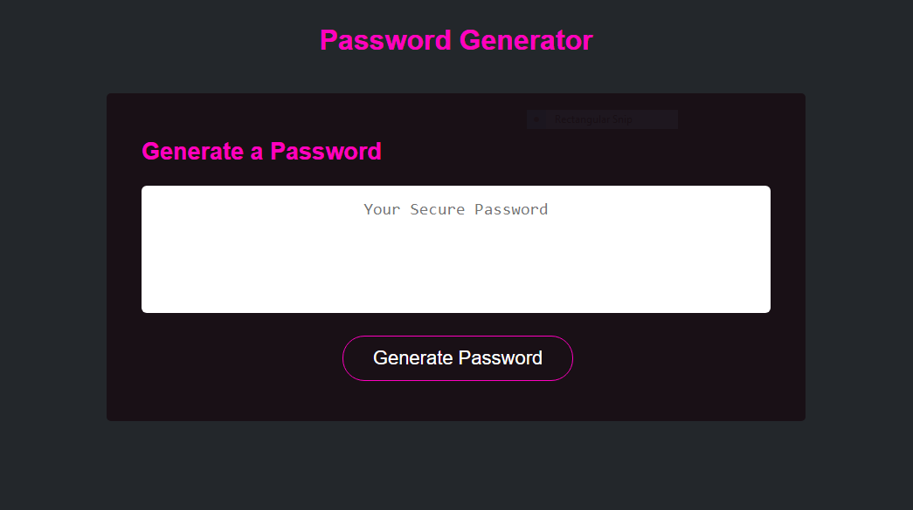

# C3-Password-Generator

## Description

In this weeks challenge we were given a webpage for a random password generator. We were tasked with creating the JavaScript code to give the site functionality. I was able to utilize what I've learned about variables, arrays, and functions and apply them to the code to allow a user to choose how long the password should be as well as which types of characters to include. I also learned some new things about how to generate random numbers of various lengths and store them as variables.

## Installation

n/a

## Usage

To use the password generator, the user will click the generate password button and then be prompted to enter how long the password will be and which types of characters to be included in the password. Once the user finishes all the selections the password will be generated and will appear inside of the text area.

The deployed site can be found here: https://peshey.github.io/C3-Password-Generator/

    
    

## Credits

The starter code for this project was provided by the U of U bootcamp and can be found in the Gitlab repository located here: https://git.bootcampcontent.com/University-of-Utah/UofU-VIRT-FSF-PT-04-2023-U-LOLC/-/tree/main/03-JavaScript/02-Challenge

## License

n/a

